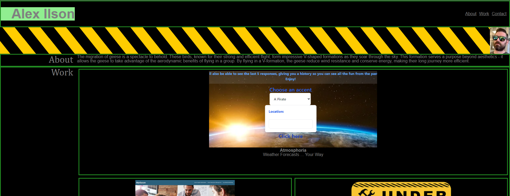

Website by Alex Ilson
It is a demo of my HTML/CSS skills.
Each link leads to a different challenge from the University of Texas at Austin Full Stack Web Development Bootcamp course.
Some of the links are placeholders that will eventually be replaced by new challenges as time passes.
Thanks for reading!

I used Xpert the AI Learning Assistant to help me write some code, noted with the comment:
/* code from Xpert */

Live URL: https://alexilson.github.io/wk2-challenge/

Repo Link: https://github.com/alexilson/wk2-challenge

